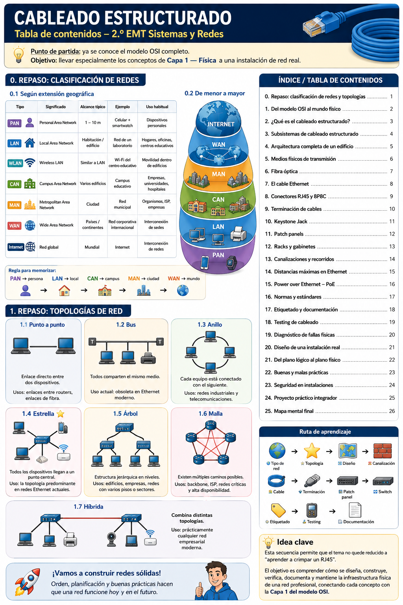
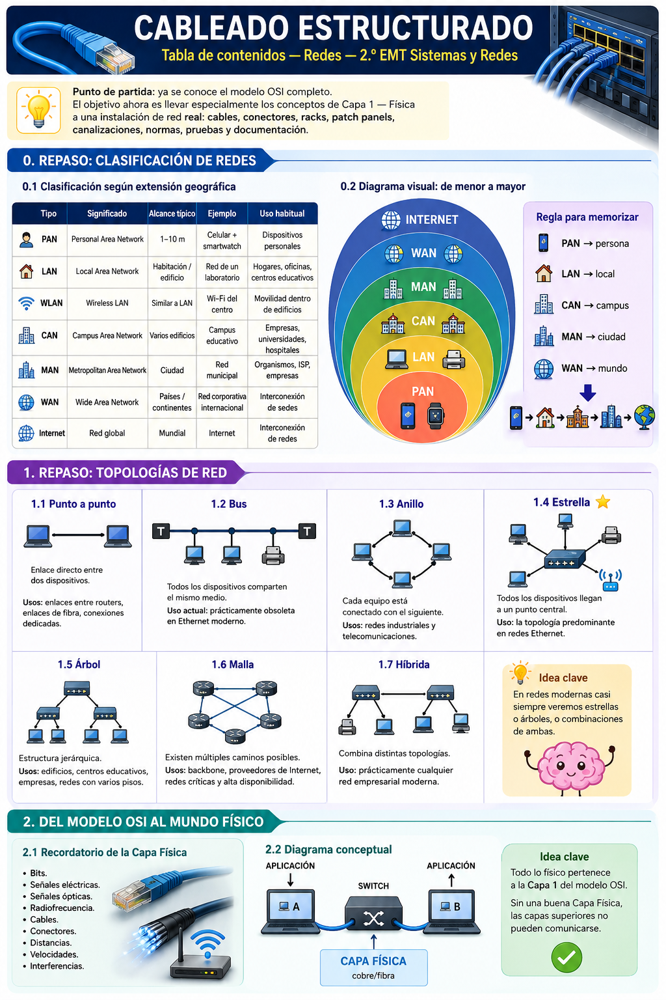
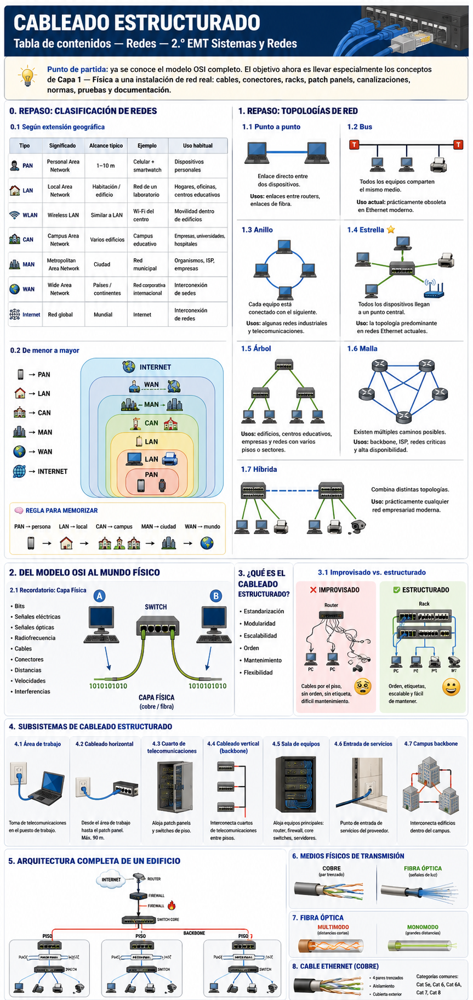

# Cableado estructurado — Redes — 2.º EMT Sistemas y Redes

> **Punto de partida:** ya se conoce el modelo OSI completo. El objetivo ahora es llevar especialmente los conceptos de **Capa 1 — Física** a una instalación de red real: cables, conectores, racks, patch panels, canalizaciones, normas, pruebas y documentación.

> **Criterio técnico usado en este material:** las distancias de la infraestructura de cableado se explican principalmente según la familia **ANSI/TIA-568** e **ISO/IEC 11801**. Las velocidades y alcances de Ethernet dependen además de la aplicación definida por **IEEE 802.3**. Las canalizaciones y espacios se relacionan con **TIA-569**, el etiquetado con **TIA-606** y la puesta a tierra/equipotencialidad con **TIA-607**.

---

## Guía visual general

---

# 0. Repaso: clasificación de redes

## 0.1 Clasificación según extensión geográfica

| Tipo | Significado | Alcance típico | Ejemplo | Uso habitual |
|---|---|---:|---|---|
| **PAN** | Personal Area Network | 1–10 m | Celular + smartwatch | Dispositivos personales |
| **LAN** | Local Area Network | Habitación / edificio | Red de un laboratorio | Hogares, oficinas, centros educativos |
| **WLAN** | Wireless LAN | Similar a LAN | Wi‑Fi del centro educativo | Movilidad dentro de edificios |
| **CAN** | Campus Area Network | Varios edificios | Campus educativo | Empresas, universidades, hospitales |
| **MAN** | Metropolitan Area Network | Ciudad | Red municipal | Organismos, ISP, empresas |
| **WAN** | Wide Area Network | Países / continentes | Red corporativa internacional | Interconexión de sedes |
| **Internet** | Red global | Mundial | Internet | Interconexión de redes |

La clasificación por extensión describe **qué superficie o distancia cubre una red**, no el tipo exacto de cable usado. Una LAN puede utilizar cobre, fibra y Wi‑Fi al mismo tiempo. En una LAN de edificio, el cableado horizontal de cobre suele diseñarse de acuerdo con **ANSI/TIA-568.1-E** e **ISO/IEC 11801-2**, mientras que una CAN suele recurrir a fibra óptica para el backbone entre edificios.

**Riesgos:** confundir alcance geográfico con tecnología; pensar, por ejemplo, que una WAN necesariamente utiliza Internet o que una LAN siempre utiliza UTP.

**Normativa relacionada:** ANSI/TIA-568, ISO/IEC 11801 e IEEE 802.3 para Ethernet.

### Regla para memorizar

**PAN → persona → LAN → local → CAN → campus → MAN → ciudad → WAN → mundo**

---

# 1. Repaso: topologías de red

## 1.1 Punto a punto

Une directamente dos equipos mediante un único enlace. Es común entre routers, switches de distribución, enlaces de fibra o conexiones dedicadas.

**Distancia:** depende del medio y de la aplicación. Un enlace de cobre Ethernet convencional está sujeto a los límites del canal de cobre; un enlace de fibra puede alcanzar desde cientos de metros hasta varios kilómetros según el tipo de fibra y el estándar IEEE utilizado.

**Riesgo:** no disponer de redundancia; si el enlace falla, se pierde la comunicación entre ambos extremos.

**Normativa relacionada:** IEEE 802.3 para Ethernet; ANSI/TIA-568.3 e ISO/IEC 11801 para cableado óptico.

## 1.2 Bus

Todos los equipos comparten un mismo medio de transmisión. Fue común en Ethernet coaxial, pero no es la topología física utilizada en el cableado estructurado Ethernet moderno.

**Uso actual:** principalmente histórico o didáctico.

**Riesgos:** una falla del medio común puede afectar a muchos nodos; resulta difícil de ampliar y diagnosticar.

**Normativa relacionada:** las instalaciones modernas de cableado estructurado se diseñan normalmente con topología jerárquica en estrella según ANSI/TIA-568 e ISO/IEC 11801.

## 1.3 Anillo

Cada equipo se conecta con el siguiente hasta cerrar un circuito.

**Uso:** puede encontrarse en redes industriales, metropolitanas o sistemas con mecanismos de redundancia en anillo.

**Distancia:** depende de la tecnología empleada y no existe una única distancia propia de la topología.

**Riesgos:** un fallo puede interrumpir el circuito si la tecnología no incorpora un camino alternativo.

**Normativa relacionada:** el medio físico utilizado debe cumplir la norma de cableado correspondiente; la topología lógica depende del protocolo empleado.

## 1.4 Estrella

Todos los dispositivos se conectan a un punto central, normalmente un **switch**. Es la estructura básica del cableado horizontal moderno.

**Distancia típica en cobre:** hasta **90 m de permanent link** y hasta **100 m de channel**, incluyendo patch cords, para las configuraciones tradicionales de cuatro pares especificadas por TIA/ISO.

**Uso:** puestos de trabajo, impresoras, cámaras, access points y teléfonos IP.

**Riesgo:** el switch central se convierte en un punto crítico; un fallo del equipo puede afectar a todos los dispositivos conectados.

**Normativa relacionada:** ANSI/TIA-568.1-E, ANSI/TIA-568.2-D, ISO/IEC 11801-1 e ISO/IEC 11801-2.

## 1.5 Árbol

Es una extensión jerárquica de la estrella: switches de acceso se conectan a equipos de distribución o core.

**Uso:** edificios de varios pisos, centros educativos, empresas y campus.

**Distancia:** cada enlace individual debe respetar el límite correspondiente al medio. El hecho de existir varios niveles de switches no permite extender un mismo enlace de cobre más allá de sus límites físicos.

**Riesgos:** una mala jerarquía puede crear cuellos de botella o puntos únicos de falla.

**Normativa relacionada:** ANSI/TIA-568 para la estructura del cableado; TIA-569 para los espacios que alojan los equipos.

## 1.6 Malla

Los nodos disponen de varios caminos posibles entre sí.

**Uso:** backbone redundante, proveedores de servicios, core de redes críticas y enlaces de alta disponibilidad.

**Distancia:** determinada por cada enlace y por la tecnología Ethernet u óptica utilizada.

**Riesgos:** mayor costo, complejidad de administración y necesidad de protocolos que eviten bucles.

**Normativa relacionada:** ANSI/TIA-568.3 para fibra y IEEE 802.3 para las aplicaciones Ethernet utilizadas sobre esos enlaces.

## 1.7 Híbrida

Combina varias topologías. Una red empresarial puede ser estrella en cada piso, árbol entre pisos y disponer de enlaces redundantes en el core.

**Uso:** prácticamente todas las redes medianas y grandes.

**Riesgos:** diseño difícil de mantener si no existe documentación adecuada.

**Normativa relacionada:** ANSI/TIA-568, TIA-606 para administración y etiquetado, y TIA-569 para recorridos y espacios.

---

# 2. Del modelo OSI al mundo físico

## 2.1 Recordatorio de la Capa Física

La Capa 1 se ocupa de convertir bits en señales y transportarlos por un medio físico. Incluye:

- Bits.
- Señales eléctricas.
- Señales ópticas.
- Radiofrecuencia.
- Cables.
- Conectores.
- Distancias.
- Velocidades.
- Interferencias.

**Uso:** constituye la base de cualquier comunicación de red.

**Riesgos:** un cable roto, exceso de distancia, conectores mal terminados, interferencia o pérdida óptica pueden provocar errores antes de que IP, TCP o las aplicaciones intervengan.

**Normativa relacionada:** ANSI/TIA-568 e ISO/IEC 11801 para el sistema de cableado; IEEE 802.3 para Ethernet.

### Idea clave

> Si la Capa 1 no funciona correctamente, las capas superiores del modelo OSI tampoco podrán comunicarse.

---

# 3. ¿Qué es el cableado estructurado?

## 3.1 Concepto

Es un sistema **normalizado, modular y documentado** de cables, conectores, canalizaciones, distribuidores y espacios de telecomunicaciones. Su objetivo es que la infraestructura pueda utilizarse con diferentes fabricantes y aplicaciones sin tener que recablear cada vez que cambia un equipo.

**Uso:** edificios comerciales, instituciones educativas, hospitales, industrias, centros de datos y campus.

**Riesgos de no estructurar:** instalaciones difíciles de mantener, cables demasiado largos, conexiones sin identificar, fallos frecuentes y ampliaciones costosas.

**Normativa relacionada:** ANSI/TIA-568.0-E, ANSI/TIA-568.1-E e ISO/IEC 11801-1.

## 3.2 Objetivos

- Estandarización.
- Modularidad.
- Escalabilidad.
- Orden.
- Mantenimiento.
- Flexibilidad.
- Documentación.
- Posibilidad de crecimiento.

Un buen diseño debe contemplar no sólo las necesidades actuales, sino también ampliaciones futuras.

**Riesgo:** diseñar exactamente para la cantidad actual de equipos suele provocar saturación de puertos, racks y canalizaciones.

**Normativa relacionada:** ANSI/TIA-568 para diseño del sistema; TIA-569 para espacio y canalización; TIA-606 para administración.

## 3.3 Cableado improvisado vs. estructurado

### Improvisado

- Cables directamente desde el switch a cada equipo.
- Recorridos por el piso.
- Ausencia de etiquetas.
- Difícil mantenimiento.
- Cambios sin documentación.

### Estructurado

- Rack.
- Patch panel.
- Switch.
- Cableado horizontal.
- Tomas de telecomunicaciones.
- Patch cords.
- Etiquetado.
- Testing y documentación.

**Riesgos del cableado improvisado:** daño mecánico, desconexiones accidentales, incumplimiento de radios de curvatura, recorridos excesivos y dificultad para localizar fallas.

**Normativa relacionada:** ANSI/TIA-568, TIA-569 y TIA-606.

---

# 4. Subsistemas de cableado estructurado

## 4.1 Área de trabajo

Es la zona donde el usuario conecta computadoras, teléfonos IP, impresoras u otros dispositivos a la toma de telecomunicaciones.

**Distancia:** forma parte del canal de hasta 100 m en el modelo clásico de cobre; el patch cord del usuario consume parte de los 10 m reservados para cordones.

**Riesgos:** patch cords excesivamente largos, dañados o de categoría inferior pueden degradar todo el canal.

**Normativa relacionada:** ANSI/TIA-568.1-E, ANSI/TIA-568.2-D e ISO/IEC 11801-2.

## 4.2 Cableado horizontal

Une el cuarto de telecomunicaciones con las tomas del área de trabajo.

**Distancia:** hasta **90 m de enlace permanente** en el diseño tradicional de cobre balanceado. El canal completo, con patch cords, puede alcanzar **100 m**.

**Uso:** puestos de trabajo, cámaras, AP, teléfonos y otros equipos terminales.

**Riesgos:** superar la distancia, instalar cerca de fuentes de EMI, aplastar el cable o exceder la tensión de tendido.

**Normativa relacionada:** ANSI/TIA-568.1-E, ANSI/TIA-568.2-D e ISO/IEC 11801-2.

## 4.3 Cuarto de telecomunicaciones

Espacio por piso o sector que contiene patch panels, switches y elementos de distribución.

**Uso:** punto de concentración del cableado horizontal.

**Riesgos:** calor excesivo, falta de espacio, polvo, humedad, acceso no autorizado o mala puesta a tierra.

**Normativa relacionada:** TIA-569-E para espacios y canalizaciones; TIA-607-E para bonding y grounding.

## 4.4 Cableado vertical o backbone

Interconecta cuartos de telecomunicaciones, pisos y salas de equipos.

**Distancia:** depende del medio. En edificios modernos suele utilizarse fibra óptica, cuya distancia depende de la aplicación IEEE 802.3 y del tipo de fibra.

**Uso:** transportar gran volumen de tráfico entre pisos.

**Riesgos:** utilizar cobre donde existe alta interferencia o grandes distancias; falta de redundancia.

**Normativa relacionada:** ANSI/TIA-568.1-E, ANSI/TIA-568.3 e ISO/IEC 11801.

## 4.5 Sala de equipos

Aloja equipos centrales: routers, firewalls, core switches, servidores y distribuidores principales.

**Uso:** concentración de la infraestructura crítica.

**Riesgos:** sobretemperatura, falta de energía protegida, inundación, polvo o acceso no controlado.

**Normativa relacionada:** TIA-569-E para el espacio físico y TIA-607-E para puesta a tierra y equipotencialidad.

## 4.6 Entrada de servicios

Es el punto donde ingresan al edificio los servicios externos del proveedor.

**Uso:** fibra del ISP, enlaces de telecomunicaciones u otros servicios.

**Riesgos:** diferencias de potencial, descargas, mala protección o recorridos no adecuados.

**Normativa relacionada:** TIA-569-E y TIA-607-E, además de la normativa eléctrica y de seguridad local.

## 4.7 Campus backbone

Interconecta varios edificios.

**Medio recomendado:** normalmente fibra óptica por aislamiento eléctrico, alcance y ancho de banda.

**Distancia:** puede alcanzar cientos de metros o kilómetros según el estándar Ethernet y los transceptores seleccionados.

**Riesgos:** utilizar cobre entre edificios puede introducir problemas por diferencias de potencial y descargas; por ello la fibra suele ser la opción técnica preferente.

**Normativa relacionada:** ANSI/TIA-568.3, ISO/IEC 11801 e IEEE 802.3.

---

# 5. Arquitectura completa de un edificio

Una arquitectura típica sigue:

**Internet → router → firewall → switch core → backbone → racks de piso → patch panels → switches de acceso → tomas → dispositivos finales**

Cada componente debe ubicarse dentro de una estructura física planificada.

**Distancias:** los enlaces horizontales de cobre respetan 90 m de permanent link / 100 m de channel; el backbone utiliza los límites propios del medio y aplicación seleccionados.

**Riesgos:** mezclar funciones, colocar switches fuera de espacios adecuados, usar patch cords como cableado permanente o no dejar capacidad futura.

**Normativa relacionada:** ANSI/TIA-568.1-E, TIA-569-E, TIA-606-C e ISO/IEC 11801-2.

---

# 6. Medios físicos de transmisión

## 6.1 Cobre

El cobre balanceado de cuatro pares es el medio más común en cableado horizontal.

**Tipos habituales:**

- U/UTP.
- F/UTP.
- U/FTP.
- S/FTP.

**Uso:** PCs, impresoras, AP, cámaras IP, teléfonos IP y dispositivos PoE.

**Distancia típica:** hasta 100 m de canal en aplicaciones Ethernet diseñadas para ese alcance.

**Riesgos:** EMI, diafonía, daño mecánico, mala terminación y puesta a tierra incorrecta de sistemas blindados.

**Normativa relacionada:** ANSI/TIA-568.2-D e ISO/IEC 11801.

## 6.2 ¿Por qué los cables están trenzados?

El trenzado ayuda a reducir el ruido electromagnético y la diafonía entre pares.

**Riesgo:** destrenzar demasiado los pares al terminar un conector aumenta la interferencia y puede hacer que el enlace deje de cumplir su categoría.

**Normativa relacionada:** ANSI/TIA-568.2-D define requisitos de desempeño para cableado balanceado.

## 6.3 Categorías

| Categoría | Aplicación habitual | Distancia orientativa |
|---|---|---|
| Cat 5e | 1 GbE | hasta 100 m |
| Cat 6 | 1 GbE; 10 GbE en recorridos reducidos | 1 GbE hasta 100 m; 10GBASE-T típicamente hasta ~55 m según condiciones |
| Cat 6A | 10 GbE | hasta 100 m |
| Cat 8 | 25/40 GbE en centros de datos | canal de hasta 30 m |

**Uso:** seleccionar la categoría según velocidad, entorno, vida útil prevista y costo.

**Riesgo:** pensar que “más categoría” siempre resuelve el problema; conectores, patch panels y patch cords deben formar parte de un canal compatible.

**Normativa relacionada:** ANSI/TIA-568.2-D, ISO/IEC 11801 e IEEE 802.3.

---

# 7. Fibra óptica

## 7.1 Principio de funcionamiento

Transporta información mediante pulsos luminosos por un núcleo de vidrio o material óptico.

**Uso:** backbone, enlaces de alta velocidad, grandes distancias y ambientes con alta interferencia eléctrica.

**Riesgos:** contaminación de conectores, radios de curvatura incorrectos y manipulación inadecuada.

**Normativa relacionada:** ANSI/TIA-568.3 e ISO/IEC 11801.

## 7.2 Multimodo

Usa fibras OM1/OM2/OM3/OM4/OM5 según la instalación.

**Uso típico:** edificios y centros de datos.

**Ejemplos de alcance Ethernet:** 10GBASE-SR puede llegar aproximadamente a **300 m sobre OM3** y **400 m sobre OM4**, según IEEE 802.3.

**Riesgos:** seleccionar una clase de fibra incompatible con la velocidad o distancia prevista.

**Normativa relacionada:** ANSI/TIA-568.3, ISO/IEC 11801 e IEEE 802.3.

## 7.3 Monomodo

Utiliza un núcleo más pequeño y está pensada para largas distancias.

**Uso típico:** campus, operadores y enlaces entre edificios.

**Ejemplo:** 10GBASE-LR puede alcanzar aproximadamente **10 km** sobre fibra monomodo compatible.

**Riesgos:** transceptores incompatibles, potencia óptica incorrecta o conectores contaminados.

**Normativa relacionada:** ANSI/TIA-568.3 e IEEE 802.3.

## 7.4 Conectores

Los más habituales son:

- **LC:** compacto y muy usado en equipos modernos.
- **SC:** mayor tamaño y uso extendido en instalaciones ópticas.

**Riesgo principal:** polvo o suciedad microscópica puede aumentar considerablemente la pérdida óptica.

**Normativa relacionada:** ANSI/TIA-568.3 e IEC/ISO aplicables a componentes ópticos.

## 7.5 Transceptores

- SFP.
- SFP+.
- QSFP y variantes.

El transceptor debe corresponder a la velocidad, longitud de onda, fibra y distancia del enlace.

**Riesgo:** asumir que todos los módulos son intercambiables.

**Normativa relacionada:** IEEE 802.3 define numerosas interfaces Ethernet; la infraestructura física debe cumplir ANSI/TIA-568.3/ISO 11801.

## 7.6 Cuándo usar cobre y cuándo fibra

**Cobre:** económico, fácil de terminar y permite PoE; ideal para los últimos metros hacia los dispositivos.

**Fibra:** mayor alcance, capacidad y aislamiento eléctrico; ideal para backbone.

**Riesgo:** seleccionar sólo por precio inicial sin considerar distancia, interferencia, crecimiento y mantenimiento.

**Normativa relacionada:** ANSI/TIA-568 e ISO/IEC 11801.

---

# 8. El cable Ethernet

## 8.1 Anatomía

Un cable balanceado suele tener:

- Cubierta exterior.
- Cuatro pares trenzados.
- Conductores de cobre.
- Separador interno en algunas categorías.
- Blindaje cuando corresponde.

**Riesgo:** utilizar CCA —copper clad aluminium— en instalaciones donde se requiere cable de cobre conforme; puede aumentar resistencia y calentamiento, especialmente con PoE.

**Normativa relacionada:** ANSI/TIA-568.2-D y requisitos de seguridad del cable aplicables al edificio.

## 8.2 Los cuatro pares

- Naranja.
- Verde.
- Azul.
- Marrón.

Los cuatro pares deben mantenerse correctamente asociados hasta la terminación.

**Riesgo:** crear un **split pair**, donde la continuidad parece correcta pero los conductores pertenecen a pares equivocados.

**Normativa relacionada:** ANSI/TIA-568.2-D y esquemas T568A/T568B.

## 8.3 Conductores sólidos vs. multifilares

**Sólido:** preferido para cableado horizontal permanente.

**Multifilar:** usado normalmente en patch cords por su flexibilidad.

**Riesgo:** utilizar el tipo incorrecto de conductor con un conector no diseñado para él.

**Normativa relacionada:** ANSI/TIA-568.2-D.

## 8.4 AWG

AWG indica el diámetro del conductor. Un número AWG menor significa un conductor más grueso.

**Uso:** influye en resistencia, flexibilidad y comportamiento térmico con PoE.

**Riesgo:** patch cords muy delgados pueden aumentar pérdidas y calentamiento.

**Normativa relacionada:** ANSI/TIA-568.2-D incorpora requisitos para componentes y cordones balanceados.

## 8.5 Radio de curvatura

El cable no debe doblarse bruscamente.

**Riesgo:** deformar la geometría de los pares aumenta pérdidas, retorno y diafonía.

**Normativa relacionada:** seguir ANSI/TIA-568, TIA-569 y especialmente las especificaciones del fabricante.

## 8.6 Tensión máxima

Durante el tendido no debe tirarse del cable con fuerza excesiva.

**Riesgo:** estirar los pares modifica su geometría y puede provocar fallas difíciles de detectar visualmente.

**Normativa relacionada:** ANSI/TIA-568 y recomendaciones del fabricante.

## 8.7 Separación respecto al cableado eléctrico

Los recorridos de datos deben planificarse considerando la proximidad a conductores eléctricos, motores, luminarias y otras fuentes de interferencia.

**Distancia:** no existe una separación universal válida para todos los casos; depende del tipo de canalización, voltaje, blindaje y reglamento aplicable.

**Riesgos:** interferencia electromagnética y seguridad eléctrica.

**Normativa relacionada:** TIA-569-E, TIA-607-E y reglamentación eléctrica local.

---

# 9. Conectores RJ45 y 8P8C

## 9.1 Qué llamamos habitualmente RJ45

En redes se usa habitualmente el término “RJ45” para el conector modular 8P8C usado en Ethernet de cobre.

**Uso:** patch cords y enlaces de cobre balanceado.

**Riesgo:** usar conectores de categoría o tipo de conductor incompatibles.

**Normativa relacionada:** ANSI/TIA-568.2-D.

## 9.2 Los ocho pines

El conector posee ocho posiciones y ocho contactos.

**Uso:** permite terminar cuatro pares balanceados.

**Riesgo:** un pin sin contacto provoca circuito abierto; dos conductores unidos pueden provocar corto.

**Normativa relacionada:** ANSI/TIA-568.2-D.

## 9.3 Norma T568A

Define un orden estandarizado para los pares en la terminación.

**Uso:** ambos extremos deben seguir la misma convención en un cable directo.

**Riesgo:** mezclar esquemas accidentalmente.

**Normativa relacionada:** ANSI/TIA-568.2-D.

## 9.4 Norma T568B

Es otro esquema de terminación admitido por la familia TIA-568.

**Uso:** ampliamente utilizado en instalaciones existentes.

**Riesgo:** cambiar de A a B sin documentación genera inconsistencias.

**Normativa relacionada:** ANSI/TIA-568.2-D.

## 9.5 Diferencias entre T568A y T568B

La diferencia principal está en la posición de los pares verde y naranja.

**Importante:** ninguno es “más rápido”; ambos pueden cumplir la misma categoría si están correctamente implementados.

**Normativa relacionada:** ANSI/TIA-568.2-D.

## 9.6 Cable directo

Tiene la misma convención en ambos extremos: A-A o B-B.

**Uso:** prácticamente todas las conexiones Ethernet modernas.

**Distancia:** forma parte del límite de canal de la aplicación utilizada.

**Normativa relacionada:** ANSI/TIA-568.2-D e IEEE 802.3.

## 9.7 Cable cruzado

Tradicionalmente usa T568A en un extremo y T568B en el otro.

**Uso histórico:** conexión directa entre dispositivos del mismo tipo.

**Riesgo:** fabricar cables cruzados innecesarios puede complicar mantenimiento y documentación.

**Normativa relacionada:** ANSI/TIA-568.2-D; Ethernet moderno suele disponer de Auto MDI-X.

## 9.8 Auto MDI-X

Permite que muchos equipos Ethernet modernos detecten automáticamente qué pares deben usar para transmitir y recibir.

**Uso:** elimina la necesidad práctica de cables cruzados en la mayoría de las redes actuales.

**Normativa relacionada:** IEEE 802.3.

---

# 10. Terminación de cables

## 10.1 Proceso general

1. Cortar el cable.
2. Retirar cuidadosamente la cubierta.
3. Ordenar los pares.
4. Mantener el trenzado lo más cerca posible de la terminación.
5. Cortar uniformemente.
6. Insertar.
7. Crimpar o ponchar.
8. Testear.

**Riesgos:** dañar conductores al pelar, destrenzar demasiado, invertir pares o no insertar completamente los hilos.

**Normativa relacionada:** ANSI/TIA-568.2-D.

## 10.2 Herramientas

- Crimpadora.
- Pelacables.
- Alicate.
- Punch-down.
- Tester.

**Uso:** cada herramienta debe ser compatible con el componente y la categoría.

**Riesgo:** una crimpadora incorrecta puede producir contactos poco confiables.

**Normativa relacionada:** ANSI/TIA-568.2-D y especificaciones del fabricante.

## 10.3 Errores frecuentes

- Pares invertidos.
- Pares abiertos.
- Cortocircuitos.
- Split pair.
- Conductores mal insertados.
- Exceso de destrenzado.

**Riesgo:** algunos errores permiten que el tester de continuidad parezca correcto, pero reducen drásticamente el rendimiento.

**Normativa relacionada:** ANSI/TIA-568.2-D; la certificación debe evaluar los parámetros requeridos por la categoría.

---

# 11. Keystone Jack

## 11.1 Qué es un keystone

Es un módulo hembra utilizado en tomas, patch panels modulares y cajas.

**Uso:** terminación del cableado horizontal sólido.

**Riesgo:** instalar un keystone de categoría inferior limita el desempeño del canal completo.

**Normativa relacionada:** ANSI/TIA-568.2-D.

## 11.2 Punch-down

Es el proceso de insertar el conductor en contactos IDC.

**Uso:** terminación profesional de cable sólido.

**Riesgo:** no insertar completamente el conductor o utilizar un esquema de colores incorrecto.

**Normativa relacionada:** ANSI/TIA-568.2-D.

## 11.3 Herramienta de impacto

Permite insertar y cortar el conductor en la terminal IDC.

**Riesgo:** usar una cuchilla o presión inadecuada puede dañar el jack.

**Normativa relacionada:** ANSI/TIA-568.2-D y documentación del fabricante.

## 11.4 Terminación T568A/T568B

La toma y el patch panel deben emplear una convención coherente.

**Recorrido típico:**  
**Cable horizontal → keystone → toma → patch cord → dispositivo**

**Normativa relacionada:** ANSI/TIA-568.2-D.

---

# 12. Patch panels

## 12.1 Función

Terminan y organizan el cableado permanente en el rack.

**Uso:** facilitar cambios sin manipular directamente el cableado horizontal.

**Riesgo:** conectar y desconectar repetidamente el cable horizontal directamente del switch reduce mantenibilidad y puede dañarlo.

**Normativa relacionada:** ANSI/TIA-568 y TIA-606.

## 12.2 Organización de conexiones

Cada puerto debe corresponder claramente con una toma del edificio.

**Riesgo:** sin organización, el diagnóstico requiere seguir físicamente cada cable.

**Normativa relacionada:** TIA-606-C.

## 12.3 Numeración de puertos

La identificación debe ser única, consistente y documentada.

**Ejemplo:** `TR1-PP01-24 → AULA203-D02`.

**Normativa relacionada:** ANSI/TIA-606-C.

## 12.4 Patch panel vs. switch

| Patch panel | Switch |
|---|---|
| Pasivo | Activo |
| Organiza y termina cables | Comunica dispositivos |
| No procesa tramas | Procesa tramas Ethernet |
| Infraestructura física | Equipo de red |

**Riesgo conceptual:** confundirlos lleva a errores de diseño y documentación.

**Normativa relacionada:** TIA-568 para cableado y IEEE 802.3 para Ethernet.

---

# 13. Racks y gabinetes

## 13.1 Rack de 19 pulgadas

Formato estándar para montar equipamiento de telecomunicaciones.

**Uso:** switches, patch panels, organizadores, servidores, UPS y otros dispositivos.

**Riesgos:** carga excesiva, equipos sin soporte correcto o falta de ventilación.

**Normativa relacionada:** TIA-569-E para espacios de telecomunicaciones y normas mecánicas aplicables al rack.

## 13.2 Unidades de rack — U

Una unidad de rack (**1U**) equivale a **1,75 pulgadas / 44,45 mm** de altura.

**Uso:** calcular capacidad del gabinete.

**Riesgo:** dimensionar el rack sin reservar crecimiento.

**Normativa relacionada:** la organización del espacio se coordina con TIA-569 y recomendaciones de fabricantes.

## 13.3 Elementos habituales

- Patch panel.
- Organizador.
- Switch.
- Router/firewall.
- Servidor.
- Bandejas.
- PDU.
- UPS.

**Riesgo:** mezclar energía y datos sin planificación o bloquear ventilación.

**Normativa relacionada:** TIA-569-E y TIA-607-E.

## 13.4 Organizadores horizontales y verticales

Mantienen patch cords ordenados y reducen tensión sobre puertos y conectores.

**Riesgo:** radios de curvatura demasiado cerrados.

**Normativa relacionada:** TIA-569 y requisitos de cableado TIA-568.

## 13.5 Bandejas

Permiten montar equipos que no poseen orejas de rack.

**Riesgo:** superar la carga soportada.

**Normativa relacionada:** especificaciones mecánicas del fabricante y planificación de espacios TIA-569.

## 13.6 PDU

Distribuye energía dentro del rack.

**Riesgo:** sobrecarga eléctrica o cableado de alimentación desordenado.

**Normativa relacionada:** normativa eléctrica local; la coordinación física se contempla en TIA-569.

## 13.7 UPS

Mantiene equipos críticos durante cortes breves y puede proteger frente a anomalías eléctricas.

**Riesgo:** baterías sin mantenimiento o dimensionamiento insuficiente.

**Normativa relacionada:** normativa eléctrica y de seguridad aplicable; TIA-607 para bonding/grounding de telecomunicaciones.

## 13.8 Ventilación

Los equipos generan calor que debe evacuarse.

**Riesgo:** alta temperatura reduce vida útil y puede provocar fallos.

**Normativa relacionada:** TIA-569 considera requisitos de espacios de telecomunicaciones; deben respetarse además las especificaciones térmicas del fabricante.

---

# 14. Canalizaciones y recorridos

## 14.1 Bandejas

Permiten transportar grandes cantidades de cable.

**Uso:** pasillos técnicos, salas y recorridos principales.

**Riesgo:** sobrecarga, cables aplastados o falta de soporte.

**Normativa relacionada:** TIA-569-E.

## 14.2 Canaletas

Protegen y ordenan cableado en paredes y áreas visibles.

**Riesgo:** saturación y radios de curvatura insuficientes.

**Normativa relacionada:** TIA-569-E.

## 14.3 Caños

Protegen cables en recorridos cerrados.

**Riesgo:** exceso de ocupación y dificultad de tendido.

**Normativa relacionada:** TIA-569-E y reglamentos de construcción locales.

## 14.4 Piso técnico

Permite distribuir cableado debajo de un piso elevado.

**Uso:** oficinas, salas técnicas y centros de datos.

**Riesgos:** desorden, bloqueo del flujo de aire o cableado sin identificación.

**Normativa relacionada:** TIA-569-E y TIA-606-C.

## 14.5 Cielorraso

Puede utilizarse para recorridos si el edificio y las normas lo permiten.

**Riesgos:** cables apoyados sobre luminarias, tuberías o elementos no diseñados como soporte.

**Normativa relacionada:** TIA-569-E y códigos locales contra incendios y construcción.

## 14.6 Separación datos / electricidad

Debe diseñarse para reducir riesgos eléctricos y EMI.

**Distancia:** depende de tensión, potencia, tipo de canalización y blindaje; no debe enseñarse como un único número universal.

**Normativa relacionada:** TIA-569-E, TIA-607-E y reglamentación eléctrica local.

## 14.7 Radio de curvatura

Los cables deben cambiar de dirección suavemente.

**Riesgo:** una curva excesiva cambia la geometría interna y degrada parámetros eléctricos u ópticos.

**Normativa relacionada:** TIA-568, TIA-569 y especificación del fabricante.

## 14.8 Crecimiento futuro

Las canalizaciones y racks deben dejar margen para futuras ampliaciones.

**Riesgo:** ocupar el 100 % desde el primer día obliga a rehacer la infraestructura.

**Normativa relacionada:** filosofía de diseño de TIA-569 y administración TIA-606.

---

# 15. Distancias máximas en Ethernet

## 15.1 Permanent Link

Es el enlace permanente entre patch panel y toma de telecomunicaciones.

**Distancia típica máxima en cobre balanceado:** **90 m**.

**Riesgo:** superar este valor puede impedir que el canal completo cumpla los requisitos de la categoría.

**Normativa relacionada:** ANSI/TIA-568 e ISO/IEC 11801.

## 15.2 Channel

Incluye permanent link más patch cords y conexiones asociadas.

**Distancia típica máxima:** **100 m** para las aplicaciones tradicionales de Ethernet sobre cuatro pares diseñadas para este modelo.

**Riesgo:** agregar “unos metros más” de patch cord puede superar el diseño del canal.

**Normativa relacionada:** ANSI/TIA-568, ISO/IEC 11801 e IEEE 802.3.

## 15.3 Regla 90 + 10

**90 m de cableado permanente + hasta 10 m de patch cords = 100 m de canal.**

Es una excelente regla pedagógica, pero debe aclararse que existen excepciones y arquitecturas específicas.

**Normativa relacionada:** ANSI/TIA-568 e ISO/IEC 11801.

---

# 16. Power over Ethernet — PoE

## 16.1 Datos + energía

PoE permite transportar alimentación eléctrica y Ethernet por el mismo cableado balanceado.

**Uso:** cámaras, AP, teléfonos IP, sensores y equipos IoT.

**Distancia:** normalmente sigue el límite de canal de la aplicación Ethernet utilizada, frecuentemente 100 m.

**Riesgo:** calentamiento de los haces de cables, especialmente con alta potencia.

**Normativa relacionada:** IEEE 802.3 y requisitos de cableado TIA-568.

## 16.2 Dispositivos típicos

- Access points.
- Cámaras IP.
- Teléfonos IP.
- Sensores.
- IoT.

**Riesgo:** asumir que cualquier puerto PoE puede alimentar cualquier dispositivo.

**Normativa relacionada:** IEEE 802.3.

## 16.3 PoE

IEEE 802.3af introdujo PoE de menor potencia.

**Uso:** teléfonos IP y dispositivos de bajo consumo.

**Riesgo:** potencia insuficiente para equipos modernos.

**Normativa relacionada:** IEEE 802.3.

## 16.4 PoE+

IEEE 802.3at incrementó la potencia disponible.

**Uso:** cámaras PTZ, AP y dispositivos de mayor consumo.

**Normativa relacionada:** IEEE 802.3.

## 16.5 PoE++

IEEE 802.3bt amplió significativamente la potencia utilizando los cuatro pares.

**Uso:** AP de alto rendimiento, iluminación, pantallas y otros dispositivos.

**Riesgos:** mayor calentamiento y necesidad de controlar categoría, AWG y tamaño de los haces.

**Normativa relacionada:** IEEE 802.3 y recomendaciones TIA para cableado que transporta alimentación remota.

## 16.6 Presupuesto de potencia

Un switch PoE posee un límite total de potencia disponible.

**Ejemplo:** aunque tenga 48 puertos, puede no ser capaz de suministrar potencia máxima a los 48 simultáneamente.

**Riesgo:** dispositivos que reinician o no arrancan cuando se supera el presupuesto.

**Normativa relacionada:** IEEE 802.3 y especificaciones del fabricante.

---

# 17. Normas y estándares

## 17.1 IEEE vs. TIA vs. ISO/IEC

- **IEEE 802.3:** define Ethernet y sus variantes.
- **TIA:** define gran parte de la infraestructura de cableado utilizada en edificios y campus.
- **ISO/IEC 11801:** define cableado genérico a nivel internacional.

**Idea clave:** IEEE puede definir qué necesita una aplicación Ethernet; TIA/ISO definen cómo debe ser la infraestructura capaz de soportarla.

## 17.2 ANSI/TIA-568

Familia principal para cableado de telecomunicaciones en instalaciones.

Incluye requisitos de:

- topología;
- componentes;
- cobre balanceado;
- fibra;
- distancias;
- instalación;
- desempeño y pruebas.

**Uso:** referencia central del curso.

## 17.3 TIA-569

Define requisitos para **pathways and spaces**: canalizaciones, cuartos de telecomunicaciones, salas de equipos y otros espacios.

**Riesgo que previene:** diseñar el cable sin haber diseñado previamente dónde pasará y dónde terminará.

## 17.4 TIA-606

Define la administración de la infraestructura de telecomunicaciones.

**Uso:** etiquetas, identificadores y registros.

**Riesgo que previene:** infraestructura imposible de mantener por falta de documentación.

## 17.5 TIA-607

Define la infraestructura de **bonding y grounding** para telecomunicaciones.

**Uso:** racks, elementos metálicos y sistemas de equipotencialidad.

**Riesgo que previene:** diferencias de potencial, ruido y problemas de seguridad.

## 17.6 ISO/IEC 11801

Define cableado genérico para instalaciones de cliente.

La serie diferencia distintos entornos, incluyendo oficinas, industria y centros de datos.

**Uso:** referencia internacional equivalente/complementaria a TIA.

## 17.7 IEEE 802.3

Define Ethernet: velocidades, interfaces físicas, PoE y numerosas características del enlace.

**Uso:** determinar qué aplicación puede funcionar sobre un determinado canal.

---

# 18. Etiquetado y documentación

## 18.1 ¿Por qué etiquetar?

Permite identificar rápidamente cada enlace sin tener que seguir físicamente el cable.

**Uso:** operación, mantenimiento y resolución de fallas.

**Riesgo:** una red sin etiquetado puede funcionar técnicamente, pero su costo de mantenimiento aumenta enormemente.

**Normativa relacionada:** ANSI/TIA-606-C.

## 18.2 Convenciones de nombres

La organización debe usar una convención consistente.

**Ejemplo:** `AULA03-D12 ↔ TR1-PP01-12`.

**Riesgo:** nombres ambiguos como “cable azul del salón”.

**Normativa relacionada:** ANSI/TIA-606-C.

## 18.3 Identificación de elementos

Debe poder identificarse:

- Rack.
- Patch panel.
- Puerto.
- Toma.
- Sala.
- Piso.
- Cable.

**Normativa relacionada:** TIA-606-C.

## 18.4 Planos

Muestran ubicación de tomas, racks, recorridos y espacios.

**Riesgo:** realizar ampliaciones sin conocer recorridos existentes.

**Normativa relacionada:** TIA-606 y TIA-569.

## 18.5 Diagramas físicos

Representan conexiones físicas reales.

**Uso:** mantenimiento y diagnóstico.

**Normativa relacionada:** TIA-606-C.

## 18.6 Registro de puertos

Debe registrar como mínimo qué toma corresponde a cada puerto del patch panel y, operativamente, a qué puerto de switch está conectado.

**Riesgo:** desconectar servicios equivocados durante mantenimiento.

**Normativa relacionada:** TIA-606-C.

---

# 19. Testing de cableado

## 19.1 Tester básico

Comprueba continuidad y wiremap.

**Uso:** detectar fallas simples de instalación.

**Limitación:** no certifica necesariamente que un enlace cumpla Cat 6, Cat 6A, etc.

**Normativa relacionada:** ANSI/TIA-568.2-D.

## 19.2 Open circuit

Uno o más conductores no tienen continuidad.

**Síntoma:** enlace inexistente o funcionamiento parcial.

**Normativa relacionada:** wiremap dentro de los requisitos de prueba de TIA-568.

## 19.3 Short circuit

Dos conductores quedan unidos eléctricamente.

**Riesgo:** fallo total del enlace y posibles problemas con alimentación remota.

**Normativa relacionada:** TIA-568.

## 19.4 Wire map incorrecto

Los pines no coinciden correctamente entre extremos.

**Riesgo:** enlace sin comunicación o comportamiento anormal.

**Normativa relacionada:** TIA-568.2-D.

## 19.5 Split pair

Los pines pueden parecer conectados correctamente, pero los conductores pertenecen a pares incorrectos.

**Riesgo:** enorme aumento de diafonía; un tester básico puede no detectarlo.

**Normativa relacionada:** TIA-568.2-D.

## 19.6 Testers profesionales

Miden parámetros como:

- pérdida de inserción;
- NEXT;
- pérdida de retorno;
- longitud;
- delay skew.

**Uso:** comprobar el desempeño real del enlace.

**Normativa relacionada:** ANSI/TIA-568.2-D e ISO/IEC 11801.

## 19.7 Certificación del cableado

Certificar significa comprobar que el enlace cumple los requisitos correspondientes a una categoría o clase.

> **Continuidad correcta ≠ enlace certificado.**

**Normativa relacionada:** ANSI/TIA-568 e ISO/IEC 11801.

---

# 20. Diagnóstico de fallas físicas

El diagnóstico debe comenzar por Capa 1 antes de investigar IP, DNS o aplicaciones.

## 20.1 LED Link / Activity

Indica si existe enlace físico y actividad.

**Riesgo:** asumir que un LED encendido demuestra que el enlace cumple rendimiento; sólo indica que existe una negociación/enlace.

**Normativa relacionada:** IEEE 802.3.

## 20.2 Cambio de patch cord

Es una prueba rápida para descartar uno de los componentes más manipulados.

**Riesgo:** reemplazarlo por otro cable de categoría desconocida.

**Normativa relacionada:** TIA-568.2-D.

## 20.3 Cambio de puerto

Permite descartar un puerto físico defectuoso.

**Riesgo:** mover conexiones sin actualizar documentación.

**Normativa relacionada:** gestión TIA-606.

## 20.4 Tester

Verifica wiremap y, según el equipo, parámetros de desempeño.

**Normativa relacionada:** TIA-568.

## 20.5 Continuidad

Comprueba que existe camino eléctrico.

**Limitación:** no garantiza calidad de transmisión.

**Normativa relacionada:** TIA-568.2-D.

## 20.6 Daño físico

Buscar:

- cortes;
- aplastamientos;
- conectores dañados;
- humedad;
- tirones;
- curvas excesivas.

**Normativa relacionada:** TIA-568 y TIA-569.

## 20.7 Interferencias

Motores, alimentación eléctrica y otros sistemas pueden introducir ruido.

**Riesgo:** errores intermitentes difíciles de reproducir.

**Normativa relacionada:** TIA-569, TIA-607 y reglamentos eléctricos.

### Orden de diagnóstico recomendado

1. Alimentación.
2. Link.
3. Patch cord.
4. Puerto.
5. Toma.
6. Patch panel.
7. Cableado permanente.
8. Distancia y categoría.
9. EMI/daño.
10. Sólo después avanzar hacia capas superiores.

---

# 21. Diseño de una instalación real

### Escenario sugerido

> Una empresa ocupa un edificio de tres pisos y necesita 80 puestos de trabajo, 12 access points, 20 cámaras IP y 10 teléfonos IP.

## 21.1 Identificar necesidades

Determinar cantidad y tipo de dispositivos, velocidades, PoE y crecimiento.

**Riesgo:** comenzar a cablear antes de conocer requerimientos.

**Normativa relacionada:** TIA-568 e ISO/IEC 11801.

## 21.2 Crear plano

Ubicar puestos, AP, cámaras, racks y recorridos.

**Normativa relacionada:** TIA-569 y TIA-606.

## 21.3 Determinar cantidad de tomas

Considerar equipos actuales y crecimiento.

**Riesgo:** diseñar una sola toma por puesto sin considerar teléfono, segundo equipo u otros servicios.

**Normativa relacionada:** TIA-568.1-E.

## 21.4 Elegir categoría de cable

Seleccionar según aplicaciones previstas y vida útil.

**Ejemplo:** Cat 6A permite planificar 10GBASE-T hasta 100 m.

**Normativa relacionada:** TIA-568.2-D, ISO/IEC 11801 e IEEE 802.3.

## 21.5 Determinar racks

Calcular espacio para patch panels, switches, UPS, organización y crecimiento.

**Normativa relacionada:** TIA-569.

## 21.6 Ubicar cuartos de telecomunicaciones

Su posición debe permitir que el cableado horizontal permanezca dentro de las distancias permitidas.

**Riesgo:** un cuarto mal ubicado obliga a recorridos superiores a 90 m.

**Normativa relacionada:** TIA-569-E y TIA-568.1-E.

## 21.7 Diseñar backbone

Seleccionar cobre o fibra según distancia, ancho de banda y entorno.

**Normativa relacionada:** TIA-568.3 e ISO/IEC 11801.

## 21.8 Seleccionar switches

Considerar:

- cantidad de puertos;
- velocidades;
- uplinks;
- PoE;
- redundancia.

**Normativa relacionada:** IEEE 802.3 para Ethernet.

## 21.9 Calcular puertos

Contar tomas y reservar capacidad futura.

**Riesgo:** instalar exactamente el número de puertos actuales.

**Normativa relacionada:** planificación TIA-568/TIA-569.

## 21.10 Considerar PoE

Calcular consumo por dispositivo y presupuesto total.

**Normativa relacionada:** IEEE 802.3.

## 21.11 Diseñar patch panels

Distribuir puertos en función de áreas, pisos o servicios.

**Normativa relacionada:** TIA-568 y TIA-606.

## 21.12 Diseñar etiquetado

Crear el esquema antes de instalar.

**Normativa relacionada:** ANSI/TIA-606-C.

## 21.13 Preparar documentación

Registrar planos, enlaces, pruebas, puertos y cambios.

**Riesgo:** una instalación no documentada se degrada rápidamente con cada modificación.

**Normativa relacionada:** TIA-606-C.

---

# 22. Del plano lógico al plano físico

## 22.1 Diagrama lógico

Muestra cómo se relacionan los equipos y redes:

**Internet → router → firewall → switch → VLAN → equipos**

No necesita representar el recorrido exacto del cable.

**Normativa relacionada:** IEEE 802.3 y otros estándares de red según la tecnología utilizada.

## 22.2 Diagrama físico

Representa:

- ubicación del rack;
- recorridos;
- tomas;
- patch panels;
- puertos;
- medios;
- longitudes aproximadas.

**Riesgo:** un buen diagrama lógico sin plano físico no permite mantener correctamente el cableado.

**Normativa relacionada:** TIA-606 y TIA-569.

---

# 23. Buenas y malas prácticas

## 23.1 Buenas prácticas

- Etiquetar ambos extremos.
- Mantener ordenado el rack.
- Utilizar patch panels.
- Respetar distancias.
- Documentar conexiones.
- Separar adecuadamente energía y datos.
- Evitar curvas pronunciadas.
- Testear cada instalación.
- Dejar capacidad de crecimiento.

**Normativa relacionada:** TIA-568, TIA-569, TIA-606 y TIA-607.

## 23.2 Malas prácticas

- Cableado tirado por el piso.
- Cables aplastados.
- Cableado de datos junto a alimentación eléctrica sin evaluación.
- Cables sin etiqueta.
- Empalmes improvisados.
- Rack desordenado.
- Falta de documentación.

**Riesgos:** fallas, interferencias, accidentes, pérdida de tiempo y dificultad para certificar el enlace.

**Normativa relacionada:** TIA-568, TIA-569 y TIA-606.

---

# 24. Seguridad en instalaciones

## 24.1 Electricidad

El instalador debe identificar líneas eléctricas y evitar trabajos inseguros.

**Riesgo:** descarga eléctrica e incendio.

**Normativa relacionada:** TIA-569/TIA-607 y reglamentos eléctricos locales.

## 24.2 Trabajo en altura

El acceso a cielorrasos y bandejas puede requerir escaleras o plataformas.

**Riesgo:** caídas.

**Normativa relacionada:** normativa de seguridad laboral local.

## 24.3 Herramientas

Usar herramientas adecuadas y en buenas condiciones.

**Riesgo:** cortes, daño del cable o terminaciones defectuosas.

## 24.4 Canalizaciones

Deben estar diseñadas para cables de telecomunicaciones y soportadas correctamente.

**Riesgo:** cables colgando de elementos eléctricos, cañerías o cielorrasos.

**Normativa relacionada:** TIA-569-E.

## 24.5 Protección personal

Utilizar protección según el trabajo: gafas, guantes, calzado, casco, etc.

**Normativa relacionada:** seguridad laboral local.

## 24.6 Puesta a tierra

Los elementos metálicos que correspondan deben integrarse correctamente al sistema de bonding/grounding.

**Riesgo:** diferencias de potencial, ruido y seguridad.

**Normativa relacionada:** ANSI/TIA-607-E.

## 24.7 Prevención de incendios

Debe utilizarse cable con clasificación adecuada al espacio y respetar barreras contra fuego.

**Riesgo:** propagación de humo y fuego.

**Normativa relacionada:** códigos de construcción/incendio locales, TIA-569 y especificaciones de seguridad del cable.

---

# 25. Proyecto práctico integrador

## Objetivo

Diseñar e implementar una pequeña red estructurada completa.

El trabajo puede incluir:

1. Interpretación de un plano.
2. Ubicación del rack.
3. Diseño de las canalizaciones.
4. Cálculo de cable necesario.
5. Selección de Cat 6/Cat 6A.
6. Instalación de keystones.
7. Terminación de patch panel.
8. Fabricación de patch cords.
9. Terminación T568A o T568B según criterio establecido.
10. Etiquetado.
11. Testing.
12. Documentación final.
13. Diagrama físico.
14. Diagrama lógico.
15. Diagnóstico de fallas introducidas deliberadamente.

### Restricciones técnicas sugeridas para la práctica

- Ningún permanent link de cobre debe superar **90 m**.
- Diseñar pensando en un máximo de **100 m de canal**.
- Mantener coherencia T568A o T568B.
- Etiquetar según una convención inspirada en TIA-606.
- Definir canalizaciones y espacios tomando TIA-569 como referencia.
- Considerar bonding/grounding cuando existan racks o componentes metálicos, siguiendo los principios de TIA-607.
- Registrar los resultados de pruebas.

**Normativa integradora:** ANSI/TIA-568, TIA-569, TIA-606, TIA-607, ISO/IEC 11801 e IEEE 802.3.

---

# 26. Mapa mental final

Secuencia conceptual recomendada:

**Tipo de red → topología → diseño → canalización → cable → terminación → patch panel → switch → etiquetado → testing → documentación**

Cada paso está relacionado con una familia normativa:

| Etapa | Norma principal |
|---|---|
| Diseño y cableado | ANSI/TIA-568 / ISO/IEC 11801 |
| Ethernet y PoE | IEEE 802.3 |
| Canalizaciones y espacios | TIA-569 |
| Etiquetado y documentación | TIA-606 |
| Bonding y grounding | TIA-607 |
| Pruebas y certificación | TIA-568 / ISO/IEC 11801 |

---

# 27. Resumen de distancias que deben recordar

| Situación | Distancia orientativa | Referencia |
|---|---:|---|
| Permanent Link de cobre | **90 m máx.** | TIA-568 / ISO 11801 |
| Channel de cobre | **100 m máx.** | TIA-568 / ISO 11801 |
| Cat 5e — 1GBASE-T | **100 m** | TIA-568 + IEEE 802.3 |
| Cat 6 — 10GBASE-T | **hasta ~55 m** según condiciones | TIA-568 + IEEE 802.3 |
| Cat 6A — 10GBASE-T | **100 m** | TIA-568 + IEEE 802.3 |
| Cat 8 — 25/40GBASE-T | **30 m de canal** | TIA-568 + IEEE 802.3 |
| 10GBASE-SR sobre OM3 | **aprox. 300 m** | IEEE 802.3 |
| 10GBASE-SR sobre OM4 | **aprox. 400 m** | IEEE 802.3 |
| 10GBASE-LR monomodo | **aprox. 10 km** | IEEE 802.3 |

> **Importante:** las distancias de fibra dependen de la aplicación Ethernet, la clase de fibra, los transceptores y el presupuesto óptico. No debe utilizarse una única “distancia máxima de fibra” como regla general.

---

# 28. Normas técnicas de referencia

## ANSI/TIA-568

Familia de estándares para cableado de telecomunicaciones. En este curso se utiliza como referencia principal para topologías, medios, componentes, distancias, instalación y pruebas.

En las revisiones recientes, **TIA-568.1-E** cubre infraestructura de telecomunicaciones en edificios comerciales; el addendum **TIA-568.1-E-1** incorpora, entre otros cambios, requisitos relacionados con cableado para access points.

Referencia oficial:  
<https://tiaonline.org/standard/tia-568/>

## ANSI/TIA-569-E

**Telecommunications Pathways and Spaces.** Define requisitos para canalizaciones y espacios de telecomunicaciones.

Referencia oficial:  
<https://tiaonline.org/standard/tia-569/>

## ANSI/TIA-606-C

**Administration Standard for Telecommunications Infrastructure.** Define principios de identificación, etiquetado y administración.

Referencia oficial:  
<https://standards.tiaonline.org/node/12188>

## ANSI/TIA-607-E

**Generic Telecommunications Bonding and Grounding (Earthing) for Customer Premises.** Publicada por TIA en 2024, establece requisitos para bonding y grounding de telecomunicaciones.

Referencia oficial:  
<https://tiaonline.org/standardannouncement/tia-publishes-new-standard-ansi-tia-607-e-generic-telecommunications-bonding-and-grounding-earthing-for-customer-premises/>

## ISO/IEC 11801-1:2017

**Information technology — Generic cabling for customer premises — Part 1: General requirements.**

La norma recibió la **Enmienda 1:2025**, por lo que debe evitarse tratar la edición original de 2017 como un documento estático sin actualizaciones.

Referencia oficial:  
<https://www.iso.org/standard/66182.html>

## ISO/IEC 11801-2:2017

Parte específica para **office premises**, útil para relacionar el estándar internacional con edificios educativos y administrativos.

Referencia oficial:  
<https://www.iso.org/standard/66183.html>

## IEEE 802.3

Familia de estándares Ethernet. Determina las características de las distintas tecnologías Ethernet, incluyendo velocidades, medios físicos y Power over Ethernet.

---

# Resultado esperado

El objetivo es evitar que el tema quede reducido a **“aprender a crimpar un RJ45”**.

Al finalizar, se debería comprender cómo se:

- diseña;
- construye;
- verifica;
- documenta;
- diagnostica;
- mantiene

la infraestructura física de una red profesional, conectando permanentemente cada concepto con la **Capa 1 del modelo OSI** y con las **normas técnicas que permiten que equipos y componentes de distintos fabricantes puedan interoperar de forma predecible**.
